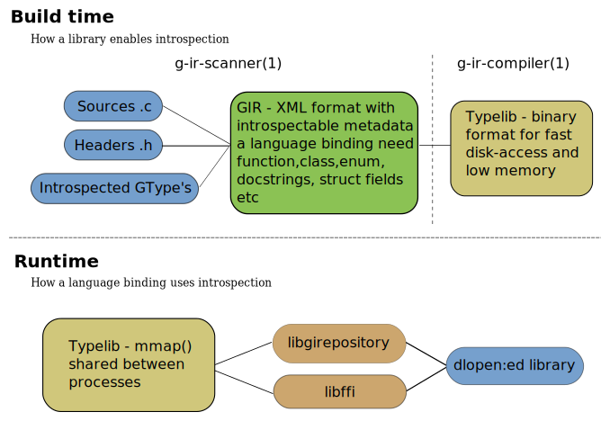

=====================
GObject Introspection
=====================

.. toctree::
    :hidden:
    :titlesonly:
    :maxdepth: 1

    goals
    architecture
    users
    writingbindingableapis
    autotoolsintegration
    annotations/index
    tools/index

GObject introspection is a middleware layer between C libraries (using
GObject) and language bindings. The C library can be scanned at compile time
and generate metadata files, in addition to the actual native C library. Then
language bindings can read this metadata and automatically provide bindings to
call into the C library.

Overview
--------

Contents of the package
-----------------------

It provides:

* An XML format called GIR containing introspection information in a machine parseable format
* Python package to create and parse the GIR format
* scanner to generate GIR format from C source and headers
* a typelib similar to xpcom/msole which stores the information on disk in a binary format
* a compiler to compile the typelib from a xml format (and vice versa)
* C library to read the typelib

Getting the code
----------------

The latest stable release is available from https://download.gnome.org

GObject Introspection is now stored in git and can be fetched::

    git clone https://gitlab.gnome.org/GNOME/gobject-introspection.git

You can browse the repository only `here <https://gitlab.gnome.org/GNOME/gobject-introspection/>`__.

GIR files are built in their respective modules.

Reporting bugs
--------------

For a list of existing bugs and feature requests, see the `Issues page
<https://gitlab.gnome.org/GNOME/gobject-introspection/issues>`__. You can also
`open an issue
<https://gitlab.gnome.org/GNOME/gobject-introspection/issues/new>`__.

Contact
-------

For questions or additional information, please use:

* Mailing list: gtk-devel-list@gnome.org
* IRC: #introspection on irc.gnome.org
